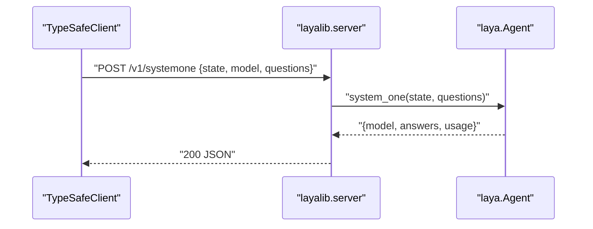

# TypeSafe 兼容 HTTP server

`src/layalib/server.py` 实现 Jev 同形状 HTTP API，给 [typesafe-sdk](https://docs.typesafe.ai/sdk/python) 打。agent 外注入，server 不 import `laya`/`torch`。

## 端点

| 方法 | 路径 | 作用 |
|------|------|------|
| `POST` | `/v1/systemone` | 评 `state` + typed `questions` |
| `GET` | `/v1/models` | 列 `jev-latest`、`laya` |

鉴权：SDK 带 `Authorization: Bearer …`，server 忽略。无 CORS。



## 请求 / 响应

`POST /v1/systemone` body：`{state, model, questions}`。`questions` 非空，每题 `type` ∈ `{noul, choice, score}`。缺 `instructions` 填 `""`。

200：

```json
{
  "model": "laya",
  "answers": {
    "billing": {"type": "noul", "noul": 0.91},
    "tone": {"type": "choice", "choice": "angry", "confidence": 0.8, "probabilities": {"calm": 0.2, "angry": 0.8}},
    "urgency": {"type": "score", "score": 1.7, "confidence": 0.7, "legend": {"0": "can wait"}, "probabilities": {"0": 1.0}}
  },
  "usage": {"input_tokens": 0, "output_tokens": 0}
}
```

agent 缺 `model`/`usage` 时 server 补 `"laya"` 和 `{0,0}`。多余字段 SDK `extra=ignore`。

422：`{"detail":[{"loc":["body","questions"],"msg":"...","type":"..."}]}`。agent 抛错 500。

## 启动

仓库根，先有权重 `models/laya-multilingual/model.safetensors`（`bash scripts/prepare.sh`）。

```bash
uv run layalib
```

缺权重 `sys.exit(2)`。

| env | 默认 | 作用 |
|-----|------|------|
| `LAYA_HOST` | `127.0.0.1` | bind |
| `LAYA_PORT` | `8000` | bind |
| `LAYA_ML_DIR` | `models/laya-multilingual` | checkpoint |
| `LAYA_DEVICE` | `cpu` | torch device |

`cwd` 必须是仓库根：`main()` 把 `laya/` 塞进 `sys.path`。

## SDK 对接

```python
from typesafe_sdk import Choice, Noul, Score, RetryPolicy, TypeSafeClient

with TypeSafeClient(
    api_key="test",
    base_url="http://127.0.0.1:8000",
    retry=RetryPolicy(max_retries=0),
) as client:
    r = client.system_one(
        state={"document": "I was charged twice. Please fix this ASAP."},
        questions={
            "billing": Noul(instructions="Is this ticket about billing?"),
            "tone": Choice(
                instructions="What is the customer's tone?",
                criteria={"calm": None, "frustrated": None, "angry": None},
            ),
            "urgency": Score(
                instructions="How urgent is this ticket?",
                criteria=["can wait", "this week", "today"],
            ),
        },
    )
    print(r.nouls["billing"].noul, r.choices["tone"].choice, r.scores["urgency"].score)
```

单测不拉权重：`tests/test_server.py` 注入 FakeAgent，真 `TypeSafeClient` 打 `ThreadingHTTPServer(port=0)`。

```bash
uv run pytest tests/test_server.py -q
```

```bash
LAYA_HOST=127.0.0.1 LAYA_PORT=8001 LAYA_ML_DIR=models/laya-multilingual LAYA_DEVICE=cpu uv run layalib

curl http://127.0.0.1:8001/v1/models | jq

curl -sS http://127.0.0.1:8001/v1/systemone \
  -H 'Content-Type: application/json' \
  -H 'Authorization: Bearer test' \
  -d '{
    "state": {"document": "I was charged twice. Please fix this ASAP."},
    "model": "laya",
    "questions": {
      "billing": {"type": "noul", "instructions": "Is this ticket about billing?"},
      "tone": {
        "type": "choice",
        "instructions": "What is the customer tone?",
        "criteria": {"calm": null, "frustrated": null, "angry": null}
      },
      "urgency": {
        "type": "score",
        "instructions": "How urgent is this ticket?",
        "criteria": ["can wait", "this week", "today"]
      }
    }
  }' | jq
```
